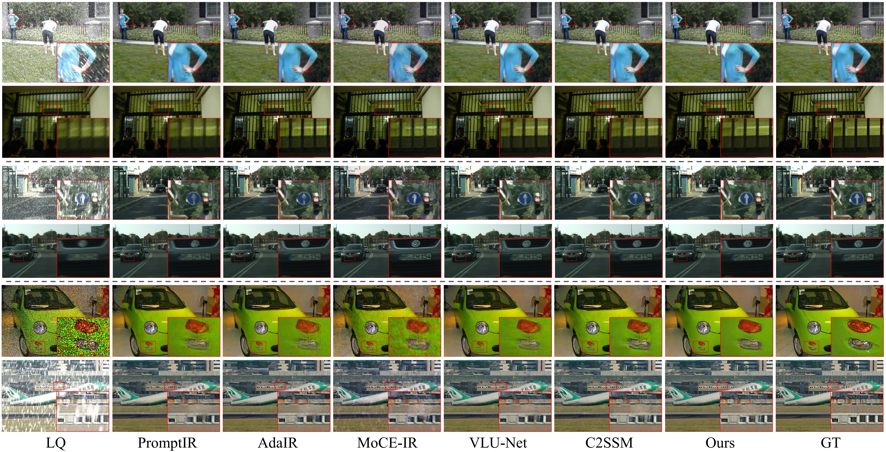
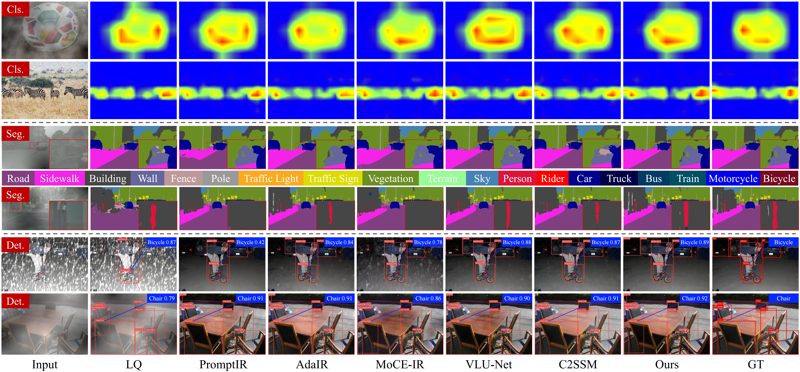

<h1 align="center">TaskIR: Task-Driven Image Restoration via Degradation Adaptation and Task Feedback</h1>

<p align="center">
  <a href="https://scholar.google.com/citations?user=4vtRInUAAAAJ&hl=en">Yanjie Tu</a><sup>1</sup>,
  <a href="https://scholar.google.com/citations?user=BSGy3foAAAAJ&hl=en">Qingsen Yan</a><sup>1,2,*</sup>,
  <a href="https://scholar.google.com/citations?user=5apnc_UAAAAJ&hl=en&oi=ao">Axi Niu</a><sup>1</sup>,
  Wenxuan Cai</a><sup>1</sup>
  <a href="https://scholar.google.com/citations?user=BNkFUbsAAAAJ&hl=en">Tao Hu</a><sup>1</sup>,
  Wei Dong</a><sup>3</sup>,
  <a href="https://scholar.google.com/citations?hl=en&user=m3gPwCoAAAAJ">Haokui Zhang</a><sup>1</sup>,
</p>

<p align="center">
  <sup>1</sup>Northwestern Polytechnical University&nbsp;&nbsp;
  <sup>2</sup>Shenzhen Research Institute of Northwestern Polytechnical University&nbsp;&nbsp;
  <sup>3</sup>Xi’an University of Architecture and Technology<br>
  <sup>*</sup>Corresponding Author
</p>


<p align="center">
  <a href='https://arxiv.org/pdf/2609.31170'></a>
</p>

---

## 🔥 Update Log

* 📢 Code released.

## 📖 Method Overview

<p align="center">
  
</p>

Overview of the proposed TaskIR framework and its key components: (a) Overall architecture of TaskIR; (b) Task-to-restoration feedback generation (TRFG); (c) Degradation-guided
transformer block (DGTB); (d) Degradation representation module (DRM); and (e) Degradationconditioned parameter generator (DPG).

## 🛠️ Environment Setup

We recommend using conda to create a clean environment.

```bash
conda create -n taskir python=3.10 -y
conda activate taskir

```

Install PyTorch with CUDA 11.8:

```bash
pip install torch==2.4.0+cu118 torchvision==0.19.0+cu118 --index-url https://download.pytorch.org/whl/cu118
```

Install other dependencies:

```bash
pip install -r requirements.txt
```


## 📂 Dataset Preparation

TaskIR is evaluated on three downstream tasks: **image classification**, **semantic segmentation**, and **object detection**.

The corresponding datasets are based on **ImageNet-1K**, **Cityscapes**, and **PASCAL VOC 2012**, respectively.
After preparing the datasets, run the following scripts to generate the required JSON metadata files.

```bash
python generate_data/Classification/process_imagenet1k.py
python generate_data/Segmentation/process_cityscapes.py
python generate_data/Detection/process_voc2012.py
```

TaskIR uses degraded low-quality (LQ) images corresponding to the three downstream datasets.

The processed LQ datasets used in our experiments will be released soon.


## 🚀 Training

TaskIR is trained in two stages: **Stage I Restoration Training** and **Stage II Task Feedback**.

### Stage I: Restoration Training

Train the degradation-adaptive restoration network using 4 GPUs:

```bash
CUDA_VISIBLE_DEVICES=0,1,2,3 torchrun --standalone --nproc_per_node=4 train.py \
  --stage restore \
  --batch_size 8 \
  --max_iters 200000
```

The Stage I checkpoint will be saved under:

```text
checkpoints/restore/
```

### Stage II: Task Feedback

After completing Stage I, train the task-feedback modules using the pretrained restoration checkpoint.

```bash
CUDA_VISIBLE_DEVICES=0,1,2,3 torchrun --standalone --nproc_per_node=4 train.py \
  --stage feedback \
  --restore_ckpt checkpoints/restore/latest_iter.pth \
  --batch_size 8 \
  --max_iters 100000
```

The Stage II checkpoint will be saved under:

```text
checkpoints/feedback/
```

## 🌍 Inference

After completing both training stages, run inference with:

```bash
python test.py \
  --restore_ckpt checkpoints/restore/latest_iter.pth \
  --feedback_ckpt checkpoints/feedback/latest_iter.pth \
  --output_path test_results/Ours \
  --task all
```

The `--task` argument specifies the downstream task used for inference:

```text
all   # Run inference for all downstream tasks
cls   # Image classification
seg   # Semantic segmentation
det   # Object detection
```

For example, to run inference only for semantic segmentation:

```bash
python test.py \
  --restore_ckpt checkpoints/restore/latest_iter.pth \
  --feedback_ckpt checkpoints/feedback/latest_iter.pth \
  --output_path test_results/Ours \
  --task seg
```

## 📊 Evaluation

Evaluate the restored results for all downstream tasks with:

```bash
python eval_restored_results.py \
  --task all \
  --results_root test_results \
  --output_root evaluation_results \
  --save_visualizations
```

Alternatively, each downstream task can be evaluated separately by setting:

```text
--task cls
--task seg
--task det
```

For example, to evaluate semantic segmentation:

```bash
python eval_restored_results.py \
  --task seg \
  --results_root test_results \
  --output_root evaluation_results/seg \
  --save_visualizations
```


## ✨ Qualitative Results

<summary><strong>Qualitative comparison of image restoration results under diverse degradations on ImageNet-1K, Cityscapes, and PASCAL VOC2012.</strong></summary>
<br>
<p align="center">
  
</p>

<summary><strong>Qualitative comparison of downstream task results under diverse degradations, including classification (Cls.), segmentation (Seg.), and detection (Det.).</strong></summary>
<br>
<p align="center">
  
</p>


## 💖 Acknowledgment

This project is based on [PromptIR](https://github.com/va1shn9v/PromptIR) and [UniRestore](https://github.com/unirestore/UniRestore). We sincerely thank the authors for their excellent works.

## 🤝🏼 Citation

If this code contributes to your research, please cite our work:

```bibtex
@article{tu2026taskir,
  title={TaskIR: Task-Driven Image Restoration via Degradation Adaptation and Task Feedback},
  author={Tu, Yanjie and Yan, Qingsen and Niu, Axi and Wenxuan Cai and Hu, Tao and Wei Dong and Zhang, Haokui},
  journal={arXiv preprint arXiv:2609.31170},
  year={2026}
}
```

## 🔆 Contact

If you have any questions, please feel free to contact me at [yanjietu@mail.nwpu.edu.cn](mailto:yanjietu@mail.nwpu.edu.cn).
